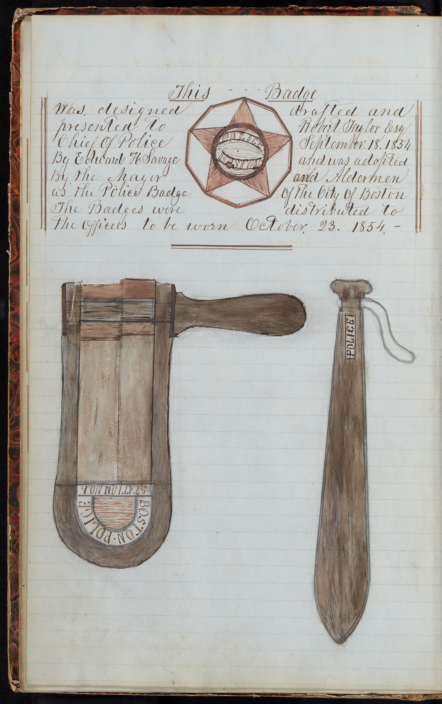

## North End Police Data (1854-59)

In 1865, Captain Savage wrote the book titled <em>A chronological history of the Boston watch and police, from 1631 to 1865; together with the Recollections of a Boston police office, or, Boston by daylight and gaslight, from the diary of an officer fifteen years in the service. By Edward H. Savage.</em>

            

 Above details about Captain Savage are generally known. But a less popular fact about Captain Savage is that he maintained a ledger for tracking arrests, crimes and public services provided by the new police force under his supervision. This website focuses on that ledger. We invite you to explore that ledger and find out more about the 19th century history of Boston police.

---

## How to use this site?

For your best experience, we suggest the following uses to different pages:
- [Data page](/policedata/data): This is the heart of our website. It shows how we have made this dataset from the diary. And it shows you how you can download this dataset. 
- Example pages ([Example 1](/policedata/example1) and [Example 2](/policedata/example2)): These pages are some of the ways in which you can use the data to deepen your understanding of the 19th century police work in Boston. This just scratches the surface of what is possible with a dataset like this.   
- [Interesting categories page ](/policedata/interesting_categories)- is a selection of categories that we believe might be super interesting to explore as a historian. There is a lot of interesting and weird stuff that can be found in this dataset, but these few categories, along with the example pages might help you start playing around with the data.   
- [Resources page](/policedata/resources): This dataset, when used in conjunction with other historical sources could be your starting point for a discovery about our past. This collection of resources about the city of Boston can help you make sense of this data in a wide variety of ways. We encourage you to explore these sites as well to help understand more about the role of police in this time period.

---
---
---
---
---

        <!-- Left side: Photo and caption -->
       

        <!-- Right side: Content (this is where your markdown gets rendered) -->

This site makes public the records of Captain Savage, who led one of Boston’s first police stations in the North End from 1854–1859.

His meticulous log of arrests, crimes and the public service by the police offers a rare, ground-level view of city life and law enforcement in a rapidly changing American neighborhood.

        
We’ve cleaned and organized this unique dataset so you can search, explore and ask new questions.

            
            

                Example page from the record book.
            

        

In 1865, Captain Savage wrote the book titled <em>A chronological history of the Boston watch and police, from 1631 to 1865; together with the Recollections of a Boston police office, or, Boston by daylight and gaslight, from the diary of an officer fifteen years in the service. By Edward H. Savage.</em>

            

 Above details about Captain Savage are generally known. But a less popular fact about Captain Savage is that he maintained a ledger for tracking arrests, crimes and public services provided by the new police force under his supervision. This website focuses on that ledger. We invite you to explore that ledger and find out more about the 19th century history of Boston police.

---

        <!-- Left side: Photo and caption -->
        

            
            

                Edward Hartwell Savage (1812-1893). The first captain of Boston Police Station Number One at North End | Photo from <a href="https://archive.org/details/bostonpolicedepa0000well/page/12/mode/2up"> Wells, Donna M. Boston Police Department. Arcadia Publishing Inc, 2003.</a>
            

        

        <!-- Right side: Content (this is where your markdown gets rendered) -->

            <h2>Foundation of Boston Police in 1854 and Captain Edward H. Savage</h2>
            

Until 1854, Boston's policing was handled by the City Watch, a volunteer system of patrol and policing.  

However, in 1854, it was replaced by a police system modelled after the London's Metropolitan police. According to <a href="https://police.boston.gov/history/">Boston Police's history</a> page.  

            

The police station at 152 North Street, North End was known as the <em>Boston Police Station Number One</em>. Edward Savage (left photo) was the first captain of this police station. Captain Savage was promoted to the position of Deputy Chief in 1861. In 1870, to the title of Chief of Police. He retired in 1878. 

He was keen about the history of Boston and wrote two major works about the history of policing in Boston.

In 1865, Captain Savage wrote the book titled <em>A chronological history of the Boston watch and police, from 1631 to 1865; together with the Recollections of a Boston police office, or, Boston by daylight and gaslight, from the diary of an officer fifteen years in the service. By Edward H. Savage.</em>

            

 Above details about Captain Savage are generally known. But a less popular fact about Captain Savage is that he maintained a ledger for tracking arrests, crimes and public services provided by the new police force under his supervision. This website focuses on that ledger. We invite you to explore that ledger and find out more about the 19th century history of Boston police.

---

## Archive details
Captain Savage’s diary of monthly reports of the activity of the police is accessible to the public through the Burns Library archive at Boston College. The diary reports the activities of Police station one of North End, Boston. You can view the scanned version at the following link: [https://library.bc.edu/iiif/view/MS2004_069_47581](https://findingaids.bc.edu/repositories/2/archival_objects/47581).  

The diary includes a lot of information about the police activities during this time period. Including but not limited to: 
- Monthly report of arrests and public service duties conducted by the police (more on this in the [Data section](/policedata/data)
- Yearly reports summarizing the same data as above
- Details about the names and addresses of the police officers
- Updates about the number of stores (for instance, how many tailor shops in the police precinct area, etc.)
- Hierarchical structure of police during this time and the name of the person holding the top offices, including the mayor. 
- Drawings of the official police badge from the time period.

|  |  |
| Image showing the official police badge of the newly formed police department | Yearly Reports as found in the document |

- Monthly report of arrests and public service duties conducted by the police (more on this in the [Data section](/policedata/data). These are presented as follows:

    

One can see that the top left quadrant of the image highlights the demography of the arrests and lodgings provided. For more details on how we use pages like these and turn them into a dateset, please visit the [Data page](policedata/data).

---

## Why is this archive important?

Captain Savage's ledger isn't just another dusty old record book – it's a goldmine of information that you simply can't find anywhere else. Here's why this collection matters:

* **Unique data that's impossible to find elsewhere.** While we know the broad strokes of how Boston's police department was formed in 1854, Captain Savage's day-to-day records show us what actually happened on the streets. This isn't history written by officials looking back – it's the real-time documentation of how America's early police forces actually worked.

* **Incredibly detailed and well-organized records.** Savage was meticulous about his record-keeping. His ledger gives us a systematic look at arrests, crimes, and public services in Boston's North End during the 1850s. The level of detail is remarkable – you can see crime patterns and understand how the new police force was finding its footing.

* **A window into 1850s Boston life.** Beyond just police work, these records capture daily life in one of Boston's most vibrant neighborhoods. You'll find stories of ordinary people dealing with extraordinary times – a city transforming from colonial town to modern metropolis.

* **Missing piece of American policing history.** The Burns Library dataset from 1855-59 covers those crucial early years when cities across America were figuring out how to do modern policing. Boston was among the first, and Captain Savage's records show us how they actually made it work.

* **Accessible to everyone.** The archives are available to public at Burns Library at Boston College. But sometimes it is difficult to process all this information. The dataset helps anyone to just start working with the data quickly. 

Whether you're a history buff, a student researching 19th-century America, or just someone curious about how Boston became the city it is today, Captain Savage's ledger offers insights you won't find in any textbook.

---

